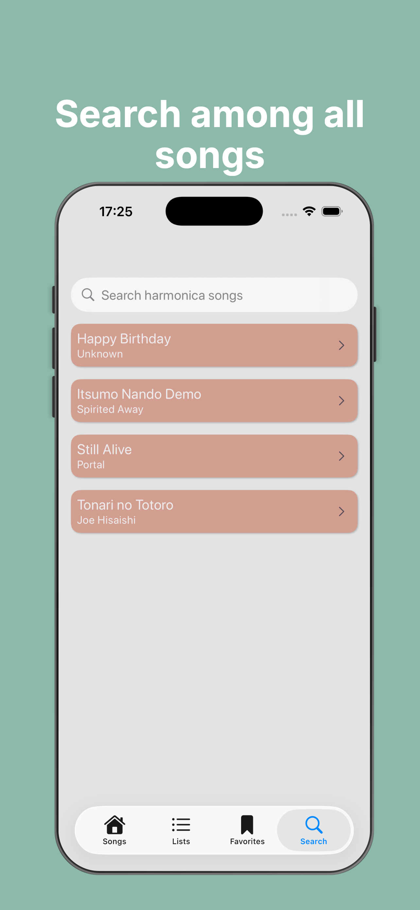
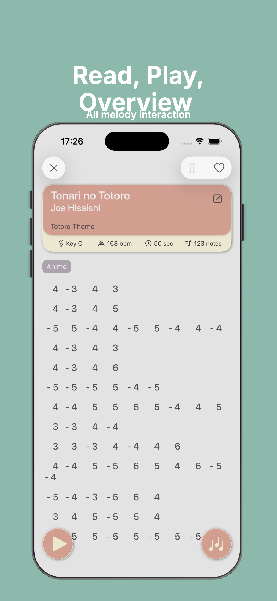
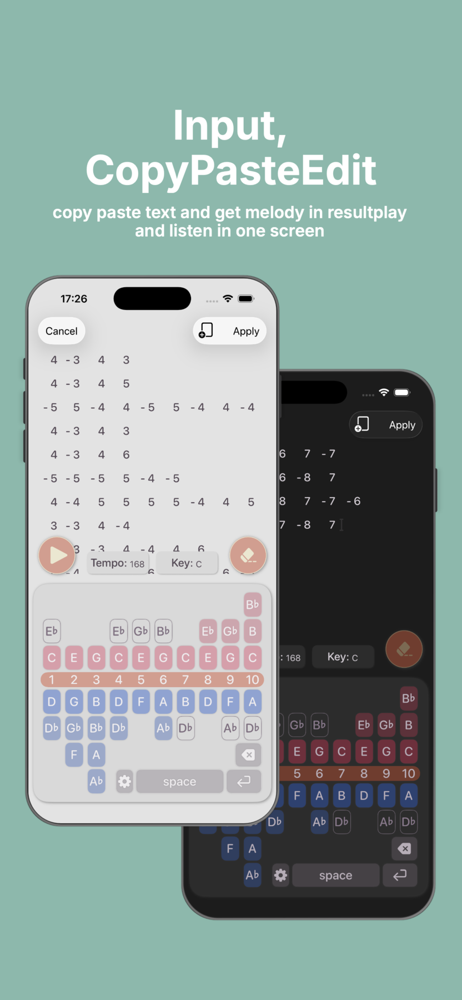
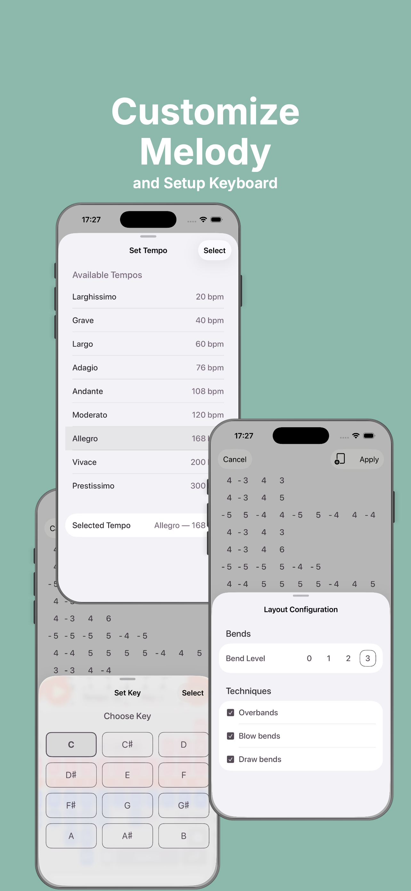
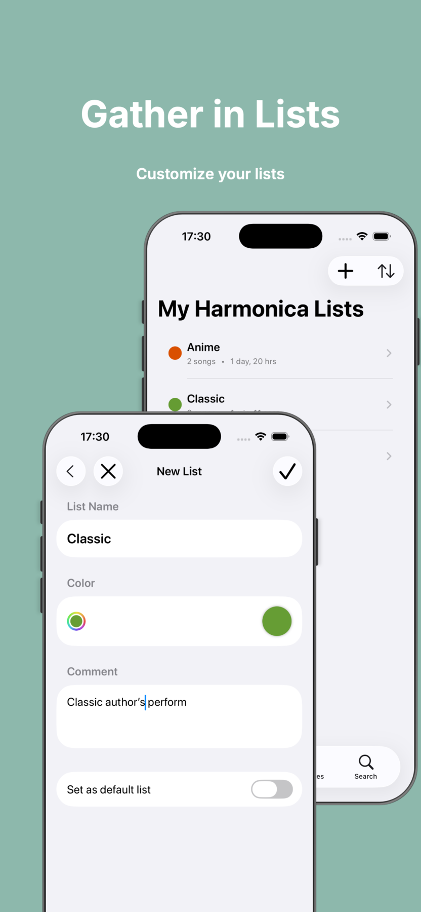

# 🎵 Harmonica Notepad

iOS app for storing, organizing, and composing harmonica tabs with musical note support.
Useful for learning play on harmonica.

## ✨ Features

-   **Song Library**  — Create, browse, and manage harmonica songs with title, key, and metadata
-   **Tab Editor**  — Compose melodies using hole numbers and bend notations (blow/draw/bend)
-   **Music Theory Integration**  — Note-aware input powered by the MusicTheory (cemolcay) library
-   **Harmonica Layout Visualizer**  — Interactive layout grid showing notes per hole, respecting key and tuning
-   **Configurable Layout**  — Lets users adjust harmonica type, key, and display preferences
-   **Persistent Storage**  — All songs and tabs saved locally via SwiftData
-   **Tab Navigation**  — Isolated per-tab navigation stacks with scoped routers

<table>
  <tr>
    <td></td>
    <td></td>
    <td></td>
    <td></td>
    <td></td>
  </tr>
</table>

## 🛠 Tech Stack

| Layer | Technology |
|---|---|
| UI | SwiftUI (iOS 26+) |
| State Management | `@Observable`, `@Environment`, `@Query` |
| Persistence | SwiftData |
| Music Theory | [MusicTheory by cemolcay](https://github.com/cemolcay/MusicTheory) |
| Navigation | Custom `Scope` + `NavigationStack` |
| Language | Swift 6 |

## 🏗 Architecture

```
HarmonicaNotepad/
├── App/
│   ├── HarmonicaNotepadApp.swift       # Entry point, SwiftData container setup
│   └── AppNavigationModel.swift        # Central navigation coordinator
├── Navigation/
│   ├── AppRouterImpl.swift             # Generic scoped router
│   ├── TabRouters.swift                # Type aliases per tab scope
│   └── Destinations/                   # NavigationDestination modifiers per tab
├── Models/
│   ├── Song.swift                      # @Model — song metadata
│   ├── Melody.swift                    # @Model — tab/note sequence
│   └── HarmonicaLayoutConfiguration.swift  # @Observable layout config
├── Views/
│   ├── SongListView.swift
│   ├── SongDetailView.swift
│   ├── MelodyEditorView.swift
│   └── HarmonicaLayoutView.swift
└── Components/
    └── Shared reusable SwiftUI components
```

## 📦 Dependencies

-   [MusicTheory](https://github.com/cemolcay/MusicTheory)  — Swift music theory library for note, scale, and chord representation

All other functionality uses native Apple frameworks only.

## 🗺 Roadmap

-   **Backup/restore merge** — compare a backup file against the current on-device
    state and merge (rather than fully replace) songs and lists on restore

## 📄 License

MIT License — see  [LICENSE](LICENSE)  for details.